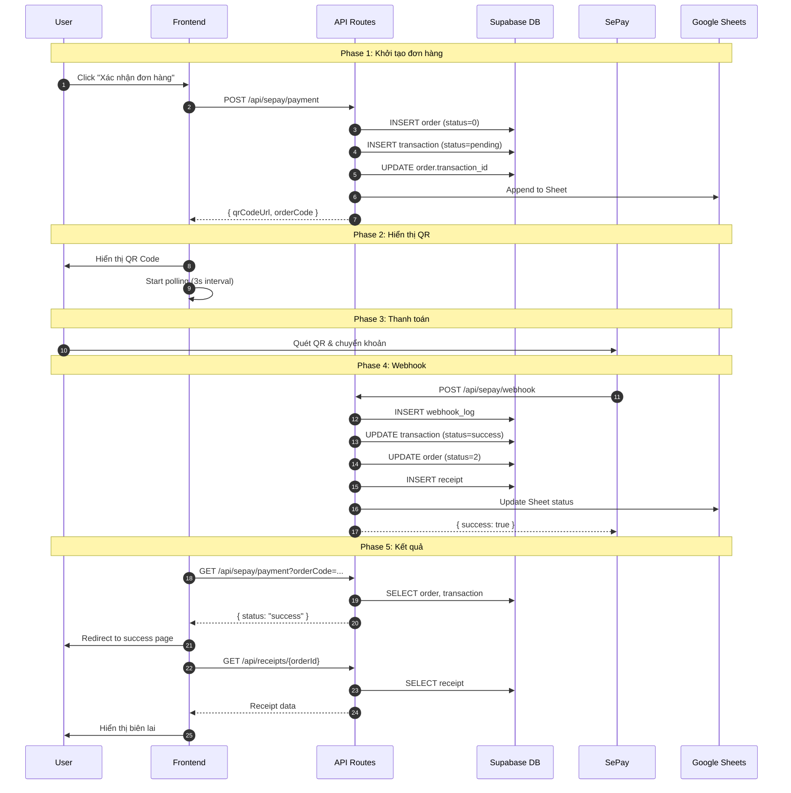

# Payment Technical Flow Documentation

Tài liệu chi tiết về luồng thanh toán trong hệ thống NEDU.

---

## Tổng Quan Kiến Trúc

```
┌─────────────┐     ┌─────────────┐     ┌─────────────┐     ┌─────────────┐
│   Frontend  │────▶│   Next.js   │────▶│  Supabase   │     │   SePay     │
│  (Browser)  │◀────│  API Routes │◀────│ PostgreSQL  │     │  Gateway    │
└─────────────┘     └─────────────┘     └─────────────┘     └─────────────┘
                           │                   ▲                    │
                           │                   │                    │
                           └───────────────────┼────────────────────┘
                                    Webhook Callback
```

---

## Database Schema

### Bảng chính liên quan đến thanh toán:

```sql
-- 1. ORDER: Lưu thông tin đơn hàng
public.order
├── id (bigint, PK)
├── code (uuid, auto-generated)      -- UUID tự động
├── full_name, email, phone, telegram
├── program, program_id, price
├── program_data (jsonb)             -- Chứa orderCode (DH...), programIds
├── status (smallint)                -- 0=pending, 2=completed, 3=failed
├── transaction_id (bigint, FK)      -- Link đến transactions
├── receipt_id (bigint, FK)          -- Link đến receipts
├── course_name, coupon_code
└── created_at, update_at

-- 2. TRANSACTIONS: Lưu thông tin giao dịch thanh toán
public.transactions
├── id (bigint, PK)
├── order_id (bigint, FK)            -- Link đến order
├── order_code (varchar)             -- Mã thanh toán: DH..., TT30N...
├── amount (numeric)
├── status (varchar)                 -- pending, success, failed
├── gateway (varchar)                -- sepay
├── gateway_transaction_id           -- ID từ SePay
├── qr_code_url (text)
├── payment_date (timestamp)
├── metadata (jsonb)                 -- Thông tin bổ sung
└── created_at, updated_at

-- 3. RECEIPTS: Biên lai thanh toán
public.receipts
├── id (bigint, PK)
├── order_id, transaction_id (FK)
├── receipt_number (varchar, unique) -- RCP-20241215-XXXX
├── customer_name, customer_email, customer_phone
├── amount, currency, payment_method
├── program_data (jsonb)
└── issued_at

-- 4. WEBHOOK_LOGS: Audit trail
public.webhook_logs
├── id (bigint, PK)
├── gateway (varchar)
├── event_type (varchar)
├── raw_payload (jsonb)              -- Lưu nguyên payload
├── processed (boolean)
├── processing_result (varchar)
├── error_message (text)
├── order_code, order_id
└── source_ip, created_at
```

---

## Luồng Thanh Toán Chi Tiết

### Phase 1: Khởi Tạo Đơn Hàng

```
User Action: Bấm "Xác nhận đơn hàng" trên checkout page
```

#### Step 1.1: Frontend gửi request

```typescript
// File: app/checkout/page.tsx
// Function: handleSubmit()

const response = await sendSePayPaymentRequest({
  fullName: formData.name,
  email: formData.email,
  phone: formData.phone,
  telegram: formData.telegram,
  amount: totalAmount,
  courseName: "Khóa học XYZ",
  programIds: ["57"]
});
```

#### Step 1.2: API xử lý request

```typescript
// File: app/api/sepay/payment/route.ts
// Function: POST()

// 1. Validate input
if (!body.fullName || !body.email || !body.amount) {
  return error(400);
}

// 2. Tạo order trong database (nếu Supabase configured)
const order = await OrderRepository.create({
  fullName: body.fullName,
  email: body.email,
  // ...
});
// → INSERT INTO public.order (...) VALUES (...)
// → order.id = 123, order.code = "uuid-xxx"
// → program_data = { orderCode: "DHXYZ123" }

// 3. Tạo transaction record
const transaction = await TransactionRepository.create({
  orderId: order.id,
  orderCode: orderCode,  // "DHXYZ123"
  amount: body.amount,
  gateway: 'sepay'
});
// → INSERT INTO public.transactions (...) VALUES (...)
// → transaction.id = 456

// 4. Link transaction với order
await OrderRepository.setTransactionId(order.id, transaction.id);
// → UPDATE public.order SET transaction_id = 456 WHERE id = 123

// 5. Generate QR Code URL
const qrCodeUrl = generateSePayQRUrl(
  accountNumber,  // "8789785904"
  bankCode,       // "MB"
  amount,         // 1000000
  orderCode       // "DHXYZ123" (nội dung chuyển khoản)
);
// → https://qr.sepay.vn/img?acc=8789785904&bank=MB&amount=1000000&des=DHXYZ123

// 6. Lưu backup vào Google Sheets
await appendToSheet({ orderCode, status: "Chờ thanh toán" });

// 7. Return response
return {
  success: true,
  qrCodeUrl: "https://qr.sepay.vn/...",
  orderCode: "DHXYZ123",
  orderId: 123,
  transactionId: 456
};
```

#### Database State sau Step 1:

```
┌─────────────────────────────────────────────────────────────┐
│ public.order                                                │
├─────────┬──────────────┬────────────┬───────────────────────┤
│ id      │ status       │ trans_id   │ program_data          │
├─────────┼──────────────┼────────────┼───────────────────────┤
│ 123     │ 0 (PENDING)  │ 456        │ {orderCode:"DHXYZ123"}│
└─────────┴──────────────┴────────────┴───────────────────────┘

┌─────────────────────────────────────────────────────────────┐
│ public.transactions                                         │
├─────────┬──────────────┬────────────┬───────────────────────┤
│ id      │ order_id     │ order_code │ status                │
├─────────┼──────────────┼────────────┼───────────────────────┤
│ 456     │ 123          │ DHXYZ123   │ pending               │
└─────────┴──────────────┴────────────┴───────────────────────┘
```

---

### Phase 2: Hiển Thị QR Code

```
User Action: Nhìn thấy màn hình QR Code
```

```typescript
// File: components/SePayPaymentQR.tsx

// Frontend nhận response và hiển thị:
  // QR Code image từ SePay

// Đồng thời bắt đầu polling kiểm tra status:
useEffect(() => {
  const interval = setInterval(async () => {
    const res = await fetch(`/api/sepay/payment?orderCode=${orderCode}`);
    const data = await res.json();
    
    if (data.order?.status === 'success') {
      onPaymentComplete();  // Chuyển đến trang success
    }
  }, 3000);  // Poll mỗi 3 giây
}, []);
```

---

### Phase 3: User Thanh Toán

```
User Action: Mở app ngân hàng → Quét QR → Chuyển khoản
```

**Nội dung chuyển khoản:** `DHXYZ123`

```
Từ: Tài khoản user
Đến: 8789785904 (MB Bank)
Số tiền: 1,000,000 VND
Nội dung: DHXYZ123
```

---

### Phase 4: Webhook Callback

```
SePay Action: Sau khi nhận tiền, gửi webhook đến backend
```

#### Step 4.1: SePay gửi POST request

```http
POST https://nedu.nhi.sg/api/sepay/webhook
Content-Type: application/json

{
  "gateway": "MBBank",
  "transactionDate": "2024-12-15 09:10:00",
  "accountNumber": "8789785904",
  "content": "DHXYZ123 thanh toan khoa hoc",
  "transferType": "in",
  "transferAmount": 1000000,
  "referenceCode": "FT24350XXXXX",
  "id": 987654
}
```

#### Step 4.2: Backend xử lý webhook

```typescript
// File: app/api/sepay/webhook/route.ts
// Function: POST()

// 1. Log webhook event (audit trail)
const webhookLog = await WebhookLogRepository.create({
  gateway: 'sepay',
  rawPayload: body,
  sourceIp: request.headers.get('x-forwarded-for')
});
// → INSERT INTO public.webhook_logs (...) VALUES (...)

// 2. Verify signature (nếu có)
if (!verifySePayWebhook(body, webhookSecret)) {
  return error(401, "Invalid signature");
}

// 3. Tìm orderCode trong content
const match = body.content.match(/(DH|TT30N)[A-Z0-9]+/);
const orderCode = match[0];  // "DHXYZ123"

// 4. Xác định payment status
let paymentStatus = 'pending';
if (body.transferAmount > 0 && body.transferType === 'in') {
  paymentStatus = 'success';
}

// 5. Tìm và update transaction
const transaction = await TransactionRepository.getByOrderCode(orderCode);
// → SELECT * FROM public.transactions WHERE order_code = 'DHXYZ123'

await TransactionRepository.updateStatus(transaction.id, 'success', {
  gatewayTransactionId: body.referenceCode,
  paymentDate: body.transactionDate,
  metadata: { gateway: body.gateway, transferAmount: body.transferAmount }
});
// → UPDATE public.transactions SET status = 'success', ... WHERE id = 456

// 6. Update order status
await OrderRepository.updateStatus(transaction.order_id, OrderStatus.COMPLETED);
// → UPDATE public.order SET status = 2 WHERE id = 123

// 7. Tạo receipt
const receipt = await ReceiptRepository.create({
  orderId: order.id,
  transactionId: transaction.id,
  customerName: order.full_name,
  amount: body.transferAmount,
  // ...
});
// → INSERT INTO public.receipts (...) VALUES (...)
// → receipt.receipt_number = "RCP-20241215-ABCD"

await OrderRepository.setReceiptId(order.id, receipt.id);
// → UPDATE public.order SET receipt_id = 789 WHERE id = 123

// 8. Update Google Sheets
await updateSheetStatus(orderCode, "Đã thanh toán");

// 9. Update webhook log
await WebhookLogRepository.updateProcessingResult(webhookLog.id, {
  processed: true,
  processingResult: 'success',
  orderCode: orderCode,
  orderId: order.id
});

// 10. Return success to SePay
return { success: true, message: "Webhook processed" };
```

#### Database State sau Phase 4:

```
┌─────────────────────────────────────────────────────────────┐
│ public.order                                                │
├─────────┬────────────────┬────────────┬─────────────────────┤
│ id      │ status         │ trans_id   │ receipt_id          │
├─────────┼────────────────┼────────────┼─────────────────────┤
│ 123     │ 2 (COMPLETED)  │ 456        │ 789                 │
└─────────┴────────────────┴────────────┴─────────────────────┘

┌─────────────────────────────────────────────────────────────┐
│ public.transactions                                         │
├─────────┬────────────┬──────────┬───────────────────────────┤
│ id      │ order_code │ status   │ gateway_transaction_id    │
├─────────┼────────────┼──────────┼───────────────────────────┤
│ 456     │ DHXYZ123   │ success  │ FT24350XXXXX              │
└─────────┴────────────┴──────────┴───────────────────────────┘

┌─────────────────────────────────────────────────────────────┐
│ public.receipts                                             │
├─────────┬────────────┬────────────────────┬─────────────────┤
│ id      │ order_id   │ receipt_number     │ amount          │
├─────────┼────────────┼────────────────────┼─────────────────┤
│ 789     │ 123        │ RCP-20241215-ABCD  │ 1000000         │
└─────────┴────────────┴────────────────────┴─────────────────┘

┌─────────────────────────────────────────────────────────────┐
│ public.webhook_logs                                         │
├─────────┬────────────┬───────────┬──────────────────────────┤
│ id      │ order_code │ processed │ processing_result        │
├─────────┼────────────┼───────────┼──────────────────────────┤
│ 111     │ DHXYZ123   │ true      │ success                  │
└─────────┴────────────┴───────────┴──────────────────────────┘
```

---

### Phase 5: Hiển Thị Kết Quả

```
User sees: Màn hình thanh toán thành công + biên lai
```

#### Step 5.1: Frontend polling phát hiện success

```typescript
// File: components/SePayPaymentQR.tsx

// Polling response:
const data = await fetch(`/api/sepay/payment?orderCode=DHXYZ123`);
// → { success: true, order: { status: "success" } }

if (data.order.status === 'success') {
  onPaymentComplete();  // Trigger callback
}
```

#### Step 5.2: Redirect đến payment-success page

```typescript
// File: app/payment-success/page.tsx

// Lấy receipt
const receipt = await fetch(`/api/receipts/${orderCode}`);
// → GET /api/receipts/DHXYZ123

// Hiển thị:
// - Receipt number: RCP-20241215-ABCD
// - Số tiền: 1,000,000 VND
// - Ngày thanh toán: 15/12/2024
// - Khóa học: Khóa học XYZ
```

---

## Sequence Diagram Tổng Hợp



---

## Error Handling

### Các trường hợp lỗi và xử lý:

| Scenario | Xử lý |
|----------|-------|
| DB không khả dụng | Fallback về in-memory + Google Sheets |
| Webhook invalid signature | Return 401, log error |
| Order không tìm thấy | Return 404, tạo minimal order từ webhook data |
| Payment không match amount | Log warning, vẫn update status |
| Receipt đã tồn tại | Skip tạo mới |

---

## Fallback Flow (Khi DB không config)

```
Supabase NOT configured → isSupabaseConfigured() = false

1. Order lưu vào in-memory Map (mất khi restart)
2. Google Sheets vẫn được update
3. Webhook handler vẫn hoạt động với in-memory
4. Response thiếu orderId, transactionId (null)
```

---

## Files Liên Quan

| File | Chức năng |
|------|-----------|
| `app/checkout/page.tsx` | Checkout UI |
| `components/SePayPaymentQR.tsx` | QR display + polling |
| `lib/payment-utils.ts` | Utility functions |
| `app/api/sepay/payment/route.ts` | Create payment |
| `app/api/sepay/webhook/route.ts` | Handle webhook |
| `app/api/orders/route.ts` | Order management |
| `app/api/receipts/[orderId]/route.ts` | Receipt retrieval |
| `lib/repositories/*.ts` | Database operations |
| `lib/db.ts` | Supabase client |
| `lib/google-sheets.ts` | Google Sheets backup |
