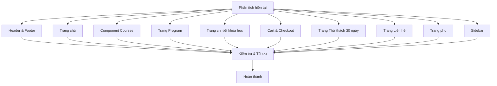
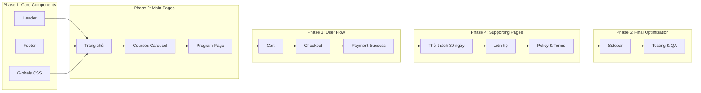
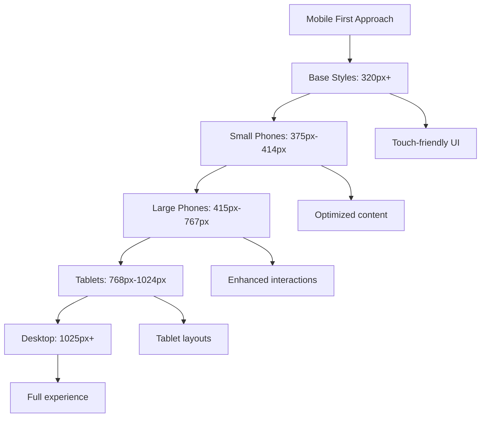

# Sơ đồ luồng công việc cải thiện Responsive cho N-Edu Website

## Overall Workflow



## Module Dependencies



## Responsive Breakpoints Strategy



## File Structure & Modifications

```mermaid
graph TD
    A[app/layout.tsx] --> A1[Container adjustments]
    A --> A2[Meta tags for mobile]
    
    B[app/globals.css] --> B1[CSS variables]
    B --> B2[Responsive utilities]
    B --> B3[Mobile-first styles]
    
    C[components/Header.tsx] --> C1[Mobile menu]
    C --> C2[Logo sizing]
    C --> C3[Touch targets]
    
    D[components/Footer.tsx] --> D1[Layout reorganization]
    D --> D2[Link spacing]
    
    E[app/page.tsx] --> E1[Hero section]
    E --> E2[Content stacking]
    
    F[app/Courses.tsx] --> F1[Carousel touch]
    F --> F2[Card sizing]
    
    G[app/program/page.tsx] --> G1[Filter layout]
    G --> G2[Grid adjustments]
    
    H[app/cart/page.tsx] --> H1[Item layout]
    H --> H2[Form controls]
    
    I[app/checkout/page.tsx] --> I1[Multi-step form]
    I --> I2[Input sizing]